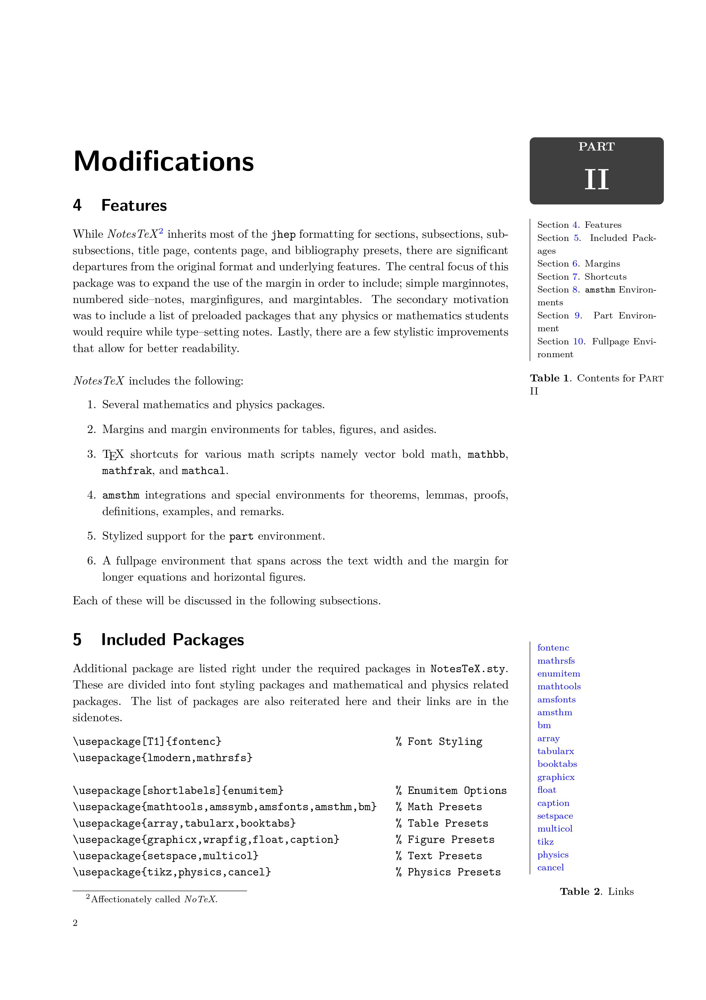
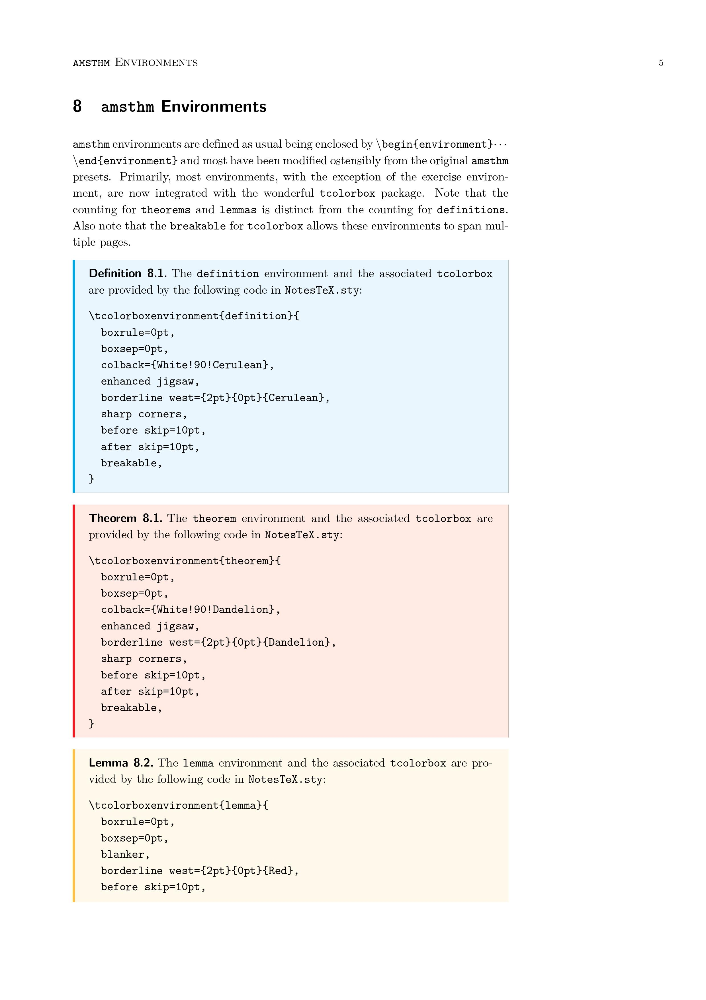
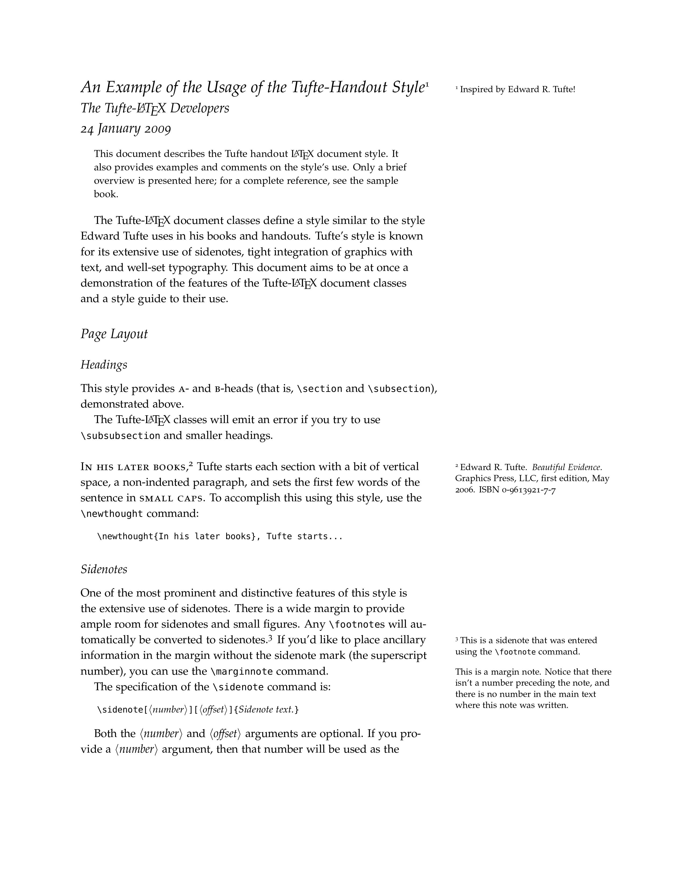
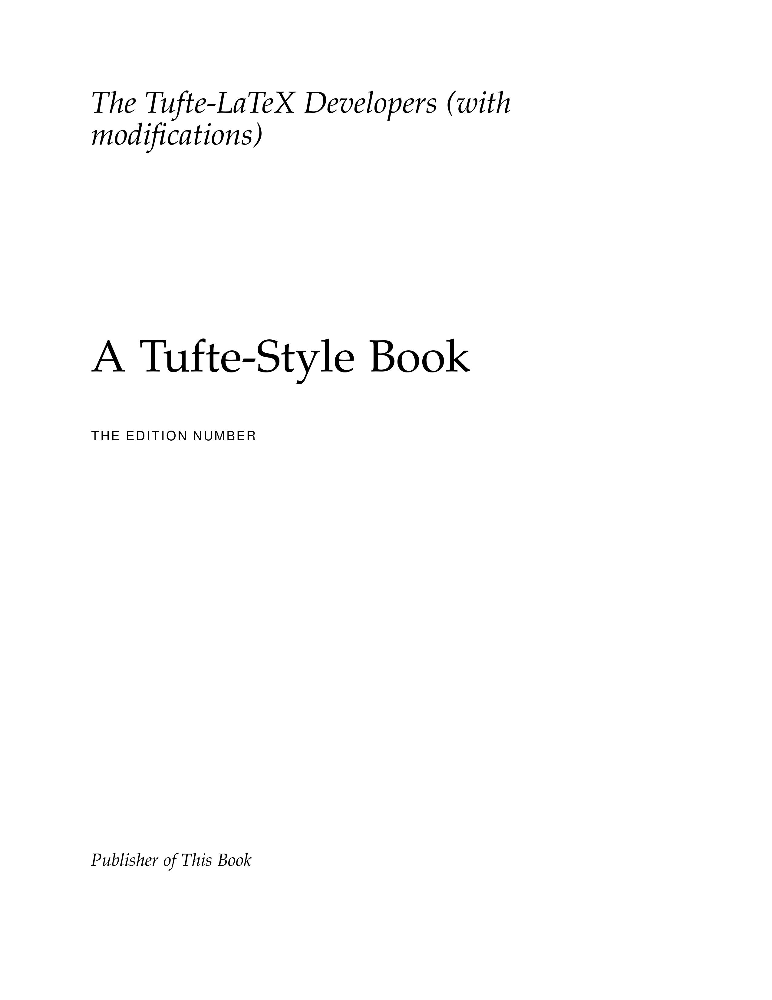
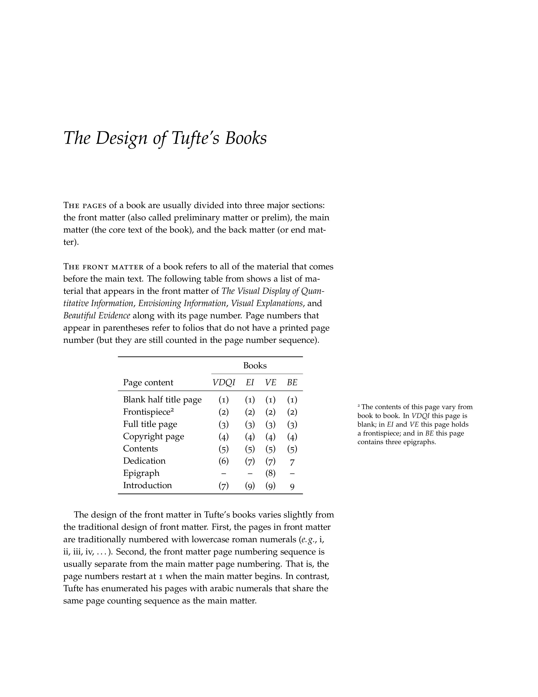
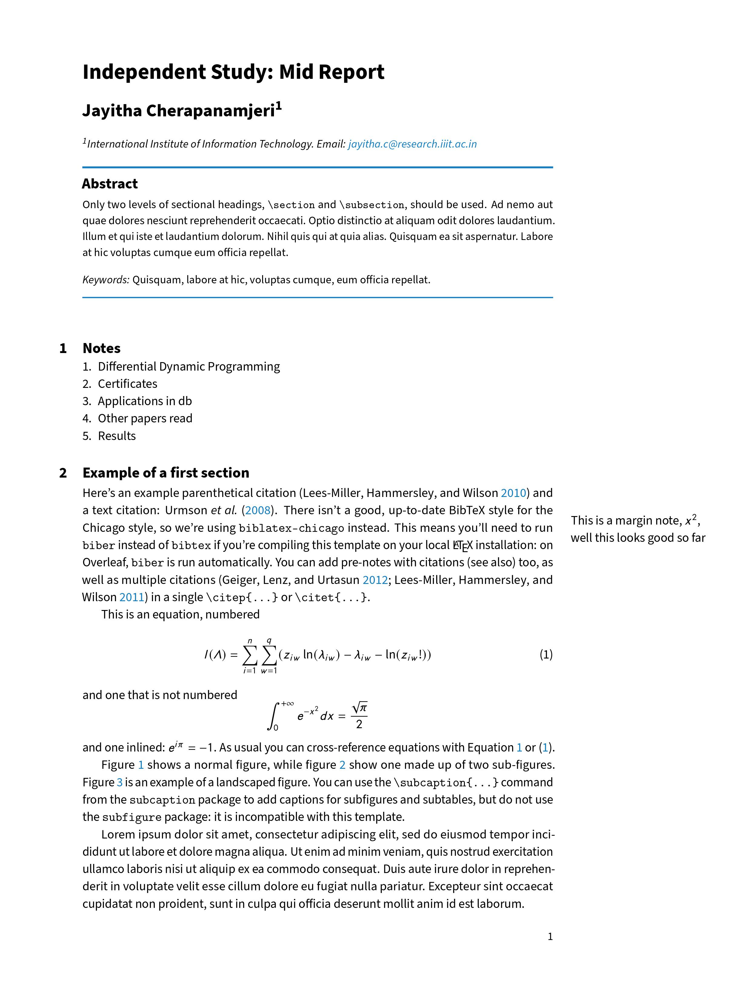
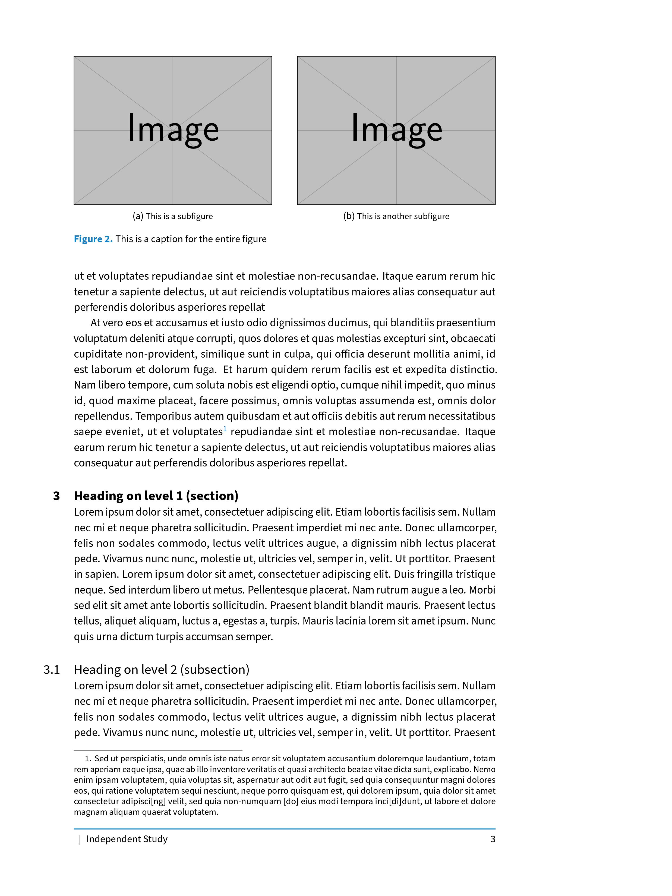

# Latex-Templates

1. [NoTeX](https://github.com/Adhumunt/NotesTeX)

|||
|---|---|
|||

2. [Tufte Handout](https://www.overleaf.com/latex/templates/example-of-the-tufte-handout-style/ysjghcrgdrnz)

| | |
|---|---|
|||

3. [Tufte Book](https://www.overleaf.com/latex/templates/handout-design-inspired-by-edward-tufte/dtsbhhkvghzz)

| | |
|---|---|
|||

4. Cambridge Inspired

| | |
|---|---|
|||

